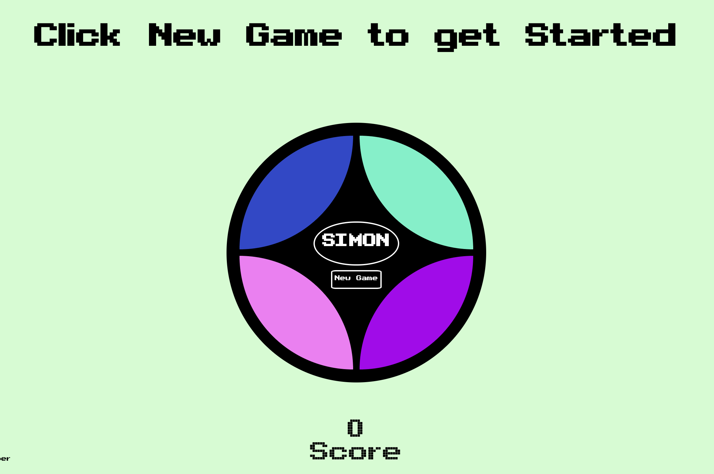

# Simon Game

## Introduction

For this project, I created a version of the classic Hasbro game Simon. The project serves as a culmination of completing my first unit at General Assembly's Software Engineering where we delved into front-end web development, utilizing HTML, CSS, & Javascript.

Link to [deployed game](https://caioingber.github.io/simon-says/)



## Development

My approach to building the current version of this project utilized a combination of functional and object-oriented methodologies to create the end product. I first began by creating an HTML skeleton of the parts of the page with basic CSS styling to have them render in a viewable way in the browser. 

Once the viewable structure of the game was built, I then outlined the overall game logic, by breaking down the various objects, variables and other data structures that would be utilized. Once my code structure had been outlined, I created DOM nodes for all the elements in play and broke down the game logic into various components and worked on them in the following order

* Starting the game
* Adding values for the Computer sequence
* Adding values for user sequence
* Comparing the values
* Determining if user wins
* Beginning a new round

## Challenges

The most difficult portion of the game logic was the comparison function. I utilized arrays to compare user and AI values and multiple conditionals to determine whether the user had input the same values. The comparison, which includes a win determining component, occurs within a singular function.

``` Javascript 
function compareValues() {
    console.log(simon)
    console.log(player)
    if (player.length === simon.length) {
        count = 0
        for (let i=0; i < blocks.length; i++) {
            blocks[i].style.pointerEvents = 'none'
        }
        for (let i=0; i < player.length; i++) {
            if(simon[i] === player[i]) {
                count++
            } 
        }
        if (count === simon.length) {
            score += 1
            if(score === 2) {
                loser.innerText = "Congratulations, You've Won! 🙌🙌🙌"
                gameScore.innerText = score
                gameWon = true
                horn.play()
                    mid.classList.add('rotate')
                    gameBoard.classList.add('rotate')
                for (let i=0; i < blocks.length; i++) {
                    blocks[i].style.pointerEvents = 'none'
                }
            } else {
                newRound()
                player = []
                count = 0
                gameScore.innerText = score
            }
        } else {
            loserSays()
        }
    } else {
        if(simon[count] === player[count]) {
            count++
        } else {
            loserSays()
        }
    }
}

```

Following the completion of constructing the base game logic, what I found to be most challenging was implementing functions to visually show AI and user input (i.e. highlighting the elements in the respective sequences). To combat this issue, I utilized a combination of setTimeout functions to have the transitions happen in sequence. I also utilized a timeOut to remove pointer-events between turns so that the player cannot click on a tile while the computer sequence is running.

``` JavaScript

function resetListen () {
    setTimeout(reset, 500 * simon.length)
}

function reset () {
    for (let i=0; i < blocks.length; i++) {
        blocks[i].addEventListener('click', playerTurn)
        blocks[i].addEventListener('click', showClick)
        blocks[i].style.pointerEvents = 'auto'
        blocks[i].style.cursor = 'pointer'
    }
}

```

## Unsolved Problems

In future iterations of this project I would like to utilize an object-oriented approach to create the elements of the game so that they interact with each in a more relational way that would allow modificatinos to happen more efficiently. I would create objects for the computer AI, the player and the game itself (which includes the methods of the game and user and computer as well).

Additionally, I would like to restructure the setTimeout events to occur recursively so that they occur after each other, as opposed to calling them separately.

## Built With

* HTML
* CSS
* Javascript

## Contributing

I welcome any and all feedback. Please fork and clone the repository and submit a pull request for any recommendations.
